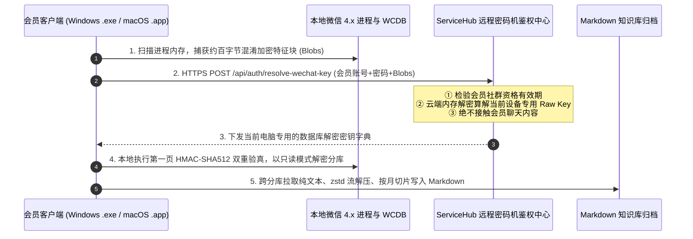

# 微信聊天记录导出助手 (社群会员版) —— 软件产品全景与分发指南 (Distribution Guide)

> **文档用途**：供社群运营者、宣发助理以及**负责内容分发与撰写文案的智能体（Agent）**快速全面了解该软件的产品定位、核心功能、技术原理、安全架构与用户痛点，以便高效撰写高转化率的社群宣发文案、用户操作指南与营销推广内容。

---

## 一、 产品全景概览 (Product Overview)

| 属性 | 详细规格 |
|---|---|
| **产品全称** | 微信 4.x 聊天记录导出助手 (社群会员版) |
| **软件形态** | **双平台独立原生免安装**：Windows (`.exe`) 单文件绿色版 + macOS (`.app`) 原生应用包，零依赖双击即用 |
| **程序体积** | Windows 版约 `33.6 MB`；macOS 版约 `16.1 MB` |
| **支持系统** | **Windows & macOS 全支持**：Windows 10 / Windows 11 (64位) 及 macOS 12+ (Apple Silicon M系列原生优化) |
| **微信版本** | 微信 4.x 桌面端（运行并登录状态） |
| **官方演示视频** | [哔哩哔哩高清演示：微微聊天记录一键导出为Markdown本地文档](https://www.bilibili.com/video/BV1rgYQ6PEPx) (BV1rgYQ6PEPx) |
| **商业模式** | **付费社群会员专属**，基于 ServiceHub 远程密码机鉴权，绑定会员账号方可使用 |
| **统一存放路径** | 项目根目录 `./`<br/>• Windows: `微信聊天记录导出助手.exe`<br/>• macOS: `微信聊天记录导出助手-macOS.zip` |

---

## 二、 核心痛点与目标用户画像 (Target Audience & Pain Points)

### 1. 目标人群
- **社群主 / 知识博主**：付费答疑群、VIP会员群中沉淀了大量优质干货问答，想系统整理成知识库但手动复制繁琐耗时；
- **自媒体创作者 / 个人IP**：需要从 1v1 私聊中提取客户真实咨询、用户反馈和私董会对话，作为小红书、公众号、知识星球的内容素材；
- **小白会员 / 非技术用户**：不懂 Python、不会敲黑窗口命令行、一看到代码环境就头大的普通电脑用户。

### 2. 用户核心痛点
- **痛点 1（微信自带导出局限）**：微信官方只能“聊天记录迁移与备份”，数据被封装在私有数据库中，无法直接转为人类可读、AI 可处理的 Markdown 文本；
- **痛点 2（资讯噪音泛滥）**：平时群聊里充斥着大量图片、表情包、语音视频、转账和拍一拍，手动整理时噪音极大；
- **痛点 3（公众号干扰）**：市面上的导出脚本往往把几百个订阅号推送、资讯早报全部混进来，严重污染真正的对话数据；
- **痛点 4（技术工具门槛极高）**：GitHub 上的开源工具普遍需要自己配 Python、编译 C 扩展、抓取密钥，小白用户 99% 卡在安装第一步。

---

## 三、 三大核心卖点与功能特性 (Unique Selling Propositions)

### 🌟 卖点 1：极致省心 —— 双平台原生免安装，告别黑窗口
- **Windows / Mac 双平台全支持**：同时提供 Windows 单文件可执行版与 macOS 原生应用包，Mac 苹果电脑（Apple Silicon M系列）与 Windows 电脑均可无差别原生运行；
- **零环境依赖**：会员电脑**无需安装 Python、C 编译器或任何第三方驱动**；
- **现代卡片式 GUI**：自适应系统原生深色/浅色模式，告别令人恐惧的黑色命令行界面；
- **秒级平滑交互**：底层采用原生 C 驱动的高性能表格，会话列表极速加载，窗口拖拽 60fps/144fps 丝滑满帧；
- **一键触达结果**：导出完毕后提供「打开导出文件夹」按钮，一键直达保存位置。

### 🌟 卖点 2：纯净干货 —— 纯文本独占与三重公众号过滤
- **绝对纯文本（Zero-Noise）**：严格仅保留 `local_type = 1` 的对话纯文本，所有图片、语音、短视频、表情包、文件表格彻底过滤，不生成无用的 `[图片]` 占位符；
- **三重公众号与系统通知拦截**：
  - 自动屏蔽所有 `gh_*` 前缀的订阅号与服务号（如 36氪、MiniMax、早报推送等）；
  - 联动通讯录官方认证标识 `verify_flag`，精准剔除企业公众号；
  - 屏蔽 `brandsessionholder`、`notifymessage`、`微信团队` 等系统推送，**呈现列表 100% 为真实好友与群聊**。

### 🌟 卖点 3：规范归档 —— 精确自然月切片与标准三行式排版
- **方案 A 规范命名**：`<目标名称>_<该月首条YYYYMMDDHHMM>-<该月末条YYYYMMDDHHMM>.md`；
- **空月自动跳过**：若某月份该群没有文本发言，坚决不创建空文档；
- **标准三行式正文排版**：
  ```markdown
  发言人名称
  YYYY年MM月DD日  H:MM
  消息正文内容

  ```
  （两条消息严格保留一个空行，自动清洗群聊 `wxid_xxxx:\n` 报头，账号本人统一显示为自定义昵称）。
- **配套 README 元数据**：自动在文件夹中生成包含会话类型、时间戳与归档规范说明书。

---

## 四、 工作原理与底层安全架构 (Architecture & Security)

该软件采用了业界领先的 **“远程密码机（Remote Cryptographic Oracle）”** 商业防盗版体系：



### 🔒 隐私与安全性保障要点（用于消除会员疑虑）
1. **零聊天隐私上云（绝对安全）**：客户端向 ServiceHub 发送的仅仅是几十字节的二进制内存结构块用于解密运算，**绝不上传任何群名、好友名称、聊天记录文本**！所有解密和提取均 100% 在会员本地电脑完成；
2. **凭据安全隔离**：用户账号密码保存在当前电脑本地 `~/.servicehub/config.json`，随时可通过界面上的「清除凭据」一键销毁；
3. **只读访问机制**：通过 SQLite 只读和不可变模式（`?mode=ro&immutable=1`）挂载数据库，绝不修改、锁定或破坏微信正在运行的数据。

---

## 五、 会员极简操作步骤 (User Workflow)

> 📺 **实操演示视频**：如需直观了解软件运行界面与 Markdown 导出全流程，可直接观看哔哩哔哩实操演示视频：[《【实用工具】微微聊天记录一键导出为Markdown本地文档》](https://www.bilibili.com/video/BV1rgYQ6PEPx)。

1. **第一步：启动微信**
   - 确保电脑已安装并登录 **微信 4.x**；
2. **第二步：打开软件**
   - **Windows 用户**：直接双击运行 `微信聊天记录导出助手.exe`；
   - **Mac 苹果用户**：解压 `微信聊天记录导出助手-macOS.zip` 得到 `微信聊天记录导出助手.app`，直接双击运行（初次运行若遇安全提示，按住 `Control` 键右键点击应用选择「打开」即可永久信任）。
3. **第三步：首次认证**
   - 首次打开点击右上角 **「会员登录」**，输入社群管理员提供的账号与授权码，点击「保存并验证」；
4. **第四步：选择会话并导出**
   - 在列表中点击选中目标群聊或好友（支持上方搜索栏实时搜索）；
   - 选择时间范围（全部历史 / 近30天 / 近90天）与保存路径；
   - 点击 **「🚀 开始全量按月导出 Markdown」**；
   - 导出完成后点击 **「📂 打开导出文件夹」**，直接查收标准化文档。

---

## 六、 宣发文案策略与参考话术 (Copywriting Angles & Templates)

负责分发撰写的智能体可根据不同受众使用以下 3 种宣传切入角度（宣发推文或社群通知末尾均可随附官方实操演示视频：[https://www.bilibili.com/video/BV1rgYQ6PEPx](https://www.bilibili.com/video/BV1rgYQ6PEPx)）：

### 视角 A：面向知识付费博主 / 社群运营者（效率赋能角度）
> **标题参考**：【社群会员福利】微信群聊干货一键导出成知识库！全网首个微信 4.x 聊天记录导出助手正式发布（Win/Mac全支持）
> **核心痛点**：群里每天聊出上百条有价值的答疑问答，但手动整理每次都要翻到眼花？
> **话术要点**：
> - 告别低效复制粘贴！专属社群会员版导出助手，双击免安装运行；
> - Windows 与 Mac 苹果电脑双平台原生支持，团队成员无论用什么电脑都能即开即用；
> - 智能按“自然月”自动精准切片生成 Markdown，直接导入 Notion、Obsidian、飞书或沉淀为 AI 知识库；
> - 彻底排除表情包、图片等一切垃圾噪音，只留纯对话干货！

### 视角 B：面向自媒体创作者 / 个人品牌主（内容素材角度）
> **标题参考**：你的微信私聊和社群，藏着挖不完的爆款内容素材！
> **核心痛点**：客户问了什么？私董会聊了什么？总在找选题，却忘了最好的选题就在历史聊天里。
> **话术要点**：
> - 一键导出私聊与群聊记录，精准到分钟的标准三行式排版；
> - 微信公众号消息自动三重过滤，100% 还原真实人类对话；
> - 配合大模型快速提炼金句、拆解痛点、沉淀 SOP。

### 视角 C：面向非技术会员（零门槛 / 易用性角度）
> **标题参考**：不用敲一行代码！小白也能轻松使用的微信聊天记录一键导出工具（Windows/Mac双平台绿色版）
> **核心痛点**：网上工具教程动不动就要 Python、黑窗口，根本看不懂也不会用？
> **话术要点**：
> - 专为我们付费社群会员定制的独立绿色软件（Windows 独立 `.exe` / Mac 独立 `.app`）；
> - 无论你是 Windows PC 还是 MacBook，下载解压双击即开，界面清爽，支持点选群聊一键导出；
> - 数据全在本地解密，零隐私泄露风险，安全省心！

---

## 七、 会员常见问题答疑库 (FAQ)

### Q1：为什么首次打开杀毒软件会提示？
- **答复口径**：微信 4.x 会对本地数据库进行多层动态加密。为了在不损坏聊天记录的前提下安全解密，软件启动时需要在内存中提取特征码给远程密码机算解。部分杀毒软件（如 360、Windows Defender）对进程读取较为敏感，请放宽心点击“信任并允许运行”或添加到白名单即可，程序 100% 绿色安全无木马。

### Q2：别人下载了这个可执行文件（EXE 或 Mac App），能用我的会员账号吗？
- **答复口径**：不能！该程序为纯净通用版，程序内部**绝对没有捆绑或泄露您的个人账号与密码**。任何人在自己的电脑上打开，状态都是“未登录”，必须输入自己的社群会员账号激活才可使用。

### Q3：聊天记录会被传到你们的服务器上吗？
- **答复口径**：绝对不会！我们非常注重隐私保护。程序只上传了几十字节用于解密运算的随机内存二进制特征块，所有聊天文字、群名称和联系人全都在您自己的电脑本地解密与清洗，全程不联网传输任何对话内容。

### Q4：Mac 苹果电脑打开时提示“无法打开”或“已损坏”怎么办？
- **答复口径**：这是 macOS 系统的安全 Gatekeeper 机制对未签名独立分发 App 的默认保护拦截。解决方法极其简单：
  1. 在访达（Finder）中找到该应用，**按住 Control 键并右键点击应用图标**，在弹出菜单中选择“打开”，在安全弹窗中点击“打开”即可永久信任；
  2. 或打开终端（Terminal）粘贴运行指令：`xattr -cr /Applications/微信聊天记录导出助手.app`（或直接将 app 拖入终端窗口后回车）即可一键清除隔离标记正常启动。
