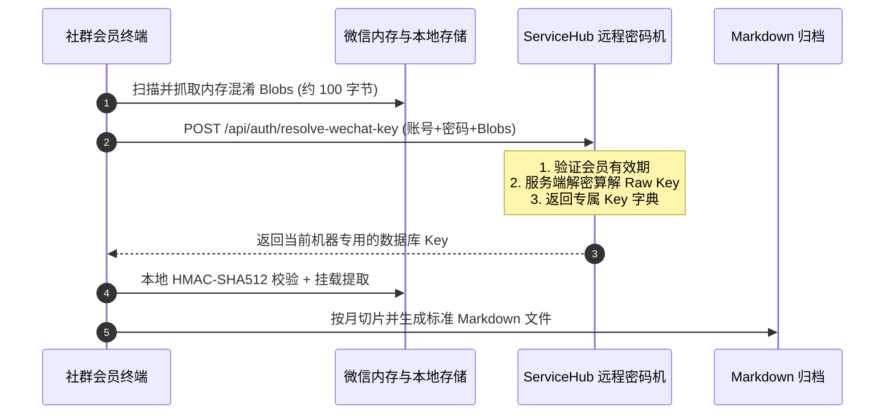

# skill-wechat-chat-exporter-member

```bash
git clone https://github.com/JasonCai2024/skill-wechat-chat-exporter-member.git
```

> **微信 4.x 聊天记录导出助手 (社群会员版)**  
> 基于 **ServiceHub 远程密码机鉴权体系** 构建的微信聊天记录按月全量纯文本导出工具。仅供社群付费会员使用，支持将指定微信群聊或私聊会话清洗并导出为标准化的 Markdown 归档文件。

---

## 🌟 核心特性与三大卖点

1. **远程密码机双重保护，彻底防盗版**：
   - 客户端内部**零硬编码通用解码掩码**，核心解密算法全部在服务端的 ServiceHub 远程密码机安全运行；
   - 会员截获的 Key 仅适用于当前微信号的特定设备，脱离 ServiceHub 授权体系后无法在任何其他设备上解密使用。
2. **纯粹干货清洗与 zstd 流解压**：
   - 严格遵循**纯文本独占原则**（仅提取 `local_type = 1`），全量过滤图片、表格（`.xlsx`）、视频、表情包与拍一拍等非文本噪音；
   - 原生支持 WCDB zstandard 字典流式解压，杜绝乱码；自动清洗 `wxid_xxxx:\n` 群聊报头。
3. **高精度自然月切片与标准三行式排版**：
   - 采用精确到分钟的 **方案 A** 命名规范（`<目标>_<首条YYYYMMDDHHMM>-<末条YYYYMMDDHHMM>.md`）；
   - 标准三行式排版（发言人、日期时间、消息正文、空行分隔），无纯文本月份自动跳过不建空文件。

---

## 🏗️ 架构与数据流转图



---

## 📦 环境依赖与前置条件

- **操作系统**：Windows 10 / 11 (x64) 或 macOS (Apple Silicon / Intel)
- **微信要求**：微信 4.x 处于运行并已登录状态
- **会员账号**：需要具备有效的 ServiceHub 社群会员账号与授权码

### 安装依赖

```bash
pip install sqlcipher3 zstandard
```

---

## 💬 能做什么与怎么对 AI 助理说

社群会员在接入 Claude Code、Antigravity 或 WorkBuddy 等智能体时，可直接使用自然语言驱动该技能：

| 能力分类 | 您可以对 AI 助理说的自然语言指令 | 对应底层 CLI 执行命令 |
|---|---|---|
| **会员登录绑定** | “帮我绑定一下社群会员账号” | `python scripts/export_chat.py --login` |
| **会话状态查询** | “帮我看看微信最近有哪些活跃的群聊或私聊” | `python scripts/export_chat.py --list --limit 10` |
| **群聊记录导出** | “帮我把 CC付费答疑群 的聊天记录按月导出归档” | `python scripts/export_chat.py -t "CC付费答疑群" -o "./output/CC付费答疑群"` |
| **私聊记录导出** | “把我和 姚先森 的私聊记录导出保存下来” | `python scripts/export_chat.py -t "姚先森" -o "./output/姚先森"` |
| **时间范围过滤** | “帮我导出 2026年6月以后 创富引擎 的聊天记录” | `python scripts/export_chat.py -t "创富引擎-创始人" --since "2026-06-01"` |

---

## 🚀 快速上手与使用示例

### 1. 首次运行：绑定社群会员凭证
只需在初次使用时配置一次，后续自动免密运行：
```bash
python scripts/export_chat.py --login
```
按照提示输入社群会员用户名和授权密码即可，配置将加密存储于 `~/.servicehub/config.json`。

### 2. 查看最近活跃的会话列表
```bash
python scripts/export_chat.py --list --limit 10
```

### 3. 导出指定微信群聊
```bash
python scripts/export_chat.py -t "CC付费答疑群" -o "./output/CC付费答疑群"
```

### 4. 导出指定好友私聊
```bash
python scripts/export_chat.py -t "姚先森" -o "./output/姚先森"
```

---

## 🔒 凭证安全与隔离说明

1. **零聊天隐私上云**：客户端仅向 ServiceHub 发送几百字节的二进制内存结构块，**绝不上传任何聊天文本、群名或好友隐私数据**；
2. **凭据安全隔离**：支持通过环境变量 `SERVICEHUB_USERNAME`、`SERVICEHUB_PASSTOKEN` 或本地配置文件 `~/.servicehub/config.json` 隔离，严禁将密码提交到代码仓库中；
3. **本地私密排除**：项目默认提供 `.gitignore`，自动排除 `.env` 及本地临时输出。

---

## 📂 技能目录结构

```text
skill-wechat-chat-exporter-member/
├── SKILL.md                 # 智能体技能标准规范说明书
├── README.md                # 技能主页说明
├── DISTRIBUTION_GUIDE.md    # 软件产品全景与宣发指南（供分发智能体撰写文案使用）
├── build_single_exe.py      # Windows 单文件 (.exe) 独立可执行程序自动打包脚本
├── .env.example             # 环境变量配置模板
├── .gitignore               # Git 忽略配置
├── scripts/                 # 核心自闭环执行脚本
│   ├── gui_app.py           # 现代卡片式桌面客户端 GUI（极速 Treeview 满帧渲染）
│   ├── wechat_key.py        # 远程密码机请求与内存特征捕获模块
│   ├── wechat_db.py         # WCDB 解密挂载、公众号拦截与纯文本抽取引擎
│   └── export_chat.py       # CLI 业务主入口（支持 --login 绑定与按月导出）
└── references/              # 业务参考标准
    ├── format_spec.md       # 排版与命名规范（方案 A）
    └── wcdb_schema.md       # WCDB 数据库字典与类型说明
```
